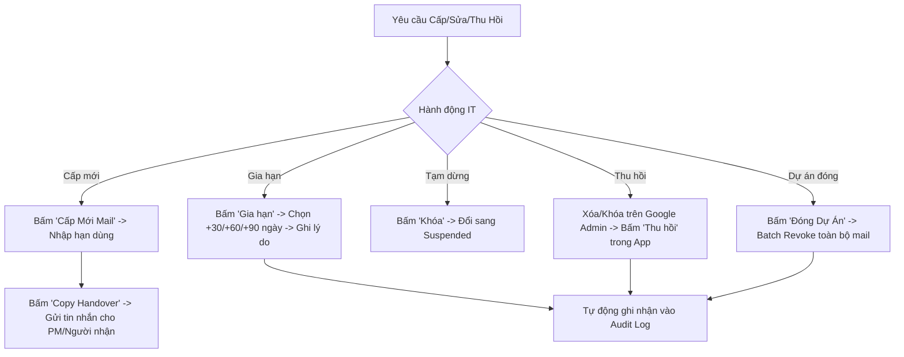

# Tài Liệu Vận Hành Hệ Thống (Operations Manual)
## Mail Account Manager — NTQ Solution

---

## 1. Công Nghệ, Dịch Vụ & Cơ Sở Dữ Liệu Đang Sử Dụng

### 1.1. Công nghệ Frontend & Kiến trúc Ứng dụng
* **Ngôn ngữ cốt lõi**: HTML5 Semantic & Vanilla JavaScript (ES6+ Modular).
* **Kiến trúc mã nguồn**: Phân tách lớp độc lập (Separation of Concerns):
  - `store.js`: Quản lý State, nghiệp vụ vòng đời, bộ nhớ và ghi nhận Audit Log.
  - `app.js`: Xử lý giao diện (UI Controller), bộ lọc đa tầng, sắp xếp tiếng Việt và tương tác Modals.
  - `csv-handler.js`: Bộ phân tích (Parser), kiểm tra dữ liệu (Validator) và xuất file CSV chuẩn UTF-8 BOM.
  - `utils.js`: Xử lý tính toán hạn dùng (Countdown), định dạng ngày tháng, Clipboard và thông báo Toast.
  - `mock-data.js`: Dữ liệu khởi tạo chuẩn định dạng `@ntq-solution.com.vn`.
* **Giao diện & Trải nghiệm (UI/UX)**: 
  - Vanilla CSS3 với Design System độc quyền phong cách SaaS cao cấp.
  - Hỗ trợ chế độ Sáng / Tối (Dark & Light Mode).
  - Tối ưu hiển thị responsive hoàn chỉnh cho Desktop, Tablet và Mobile.
  - Typography: Google Font *Plus Jakarta Sans*.

---

### 1.2. Dịch Vụ & Hạ Tầng Máy Chủ (Infrastructure & Web Server)
* **Hệ điều hành máy chủ**: Ubuntu 24.04 LTS (Noble Numbat).
* **Web Server**: **Nginx** (High Performance HTTP Server).
  - Cấu hình nén **Gzip** tự động tối ưu hóa băng thông và tăng tốc độ tải trang.
  - Cơ chế Cache tĩnh cho các file CSS, JS, Fonts và hình ảnh (Cache-Control 7 days).
* **Quản lý tiến trình (Process Management)**: **Systemd**:
  - Tự động khởi động cùng hệ điều hành (`systemctl enable nginx`).
  - Tự phục hồi khi bị tắt hoặc lỗi đột ngột (`Restart=always`, thời gian chờ phục hồi 5s).
* **Bảo mật mạng**: Tường lửa **UFW** (Uncomplicated Firewall) mở cổng tiêu chuẩn 80 (HTTP) và 443 (HTTPS).

---

### 1.3. Cơ Sở Dữ Liệu & Cơ Chế Lưu Trữ (Database & Storage)

* **Cơ chế lưu trữ hiện tại (v1)**: **Client-side LocalStorage Engine** (Key-Value NoSQL Store).
  - `mam_accounts_v2`: Lưu toàn bộ danh sách tài khoản email, người dùng, dự án, hạn dùng, trạng thái và số lần gia hạn.
  - `mam_audit_logs_v2`: Lưu toàn bộ lịch sử vết thao tác (Ai làm, hành động gì, thời gian, lý do chi tiết).
  - `mam_theme_pref`: Lưu trạng thái giao diện Sáng/Tối của người dùng.
* **Đặc điểm & Ưu điểm**:
  - Không phụ thuộc vào database server phức tạp (như MySQL/Postgres), không phát sinh lỗi kết nối DB, tốc độ phản hồi tức thì (Zero-latency).
  - Dữ liệu tồn tại vĩnh viễn trên trình duyệt của IT Admin ngay cả khi tắt máy hoặc đóng tab.
* **Cơ chế Sao lưu & Phục hồi (Backup / Restore)**:
  - Thông qua tính năng **Export CSV** (định dạng UTF-8 BOM hiển thị chuẩn tiếng Việt trên Microsoft Excel).
  - Khi cần nạp lại dữ liệu hoặc chuyển máy tính: dùng tính năng **Import CSV** có màn hình xem trước (Preview).
* **Lộ trình nâng cấp (v2 Roadmap)**:
  - Khi nhiều IT Admin cùng quản trị đồng thời từ các máy tính khác nhau: Kết nối tới cơ sở dữ liệu tập trung (**PostgreSQL** hoặc **MongoDB**) thông qua RESTful API (Node.js/FastAPI/Golang).

---

## 2. Quy Trình Vận Hành Hằng Ngày Dành Cho IT Admin



### 2.1. Cấp mới tài khoản email dự án
1. IT tạo tài khoản trên hệ thống mail thật (Google Workspace / Microsoft 365).
2. Mở ứng dụng -> Bấm nút **"Cấp Mới Mail"**.
3. Điền các trường:
   - **Email**: ví dụ `du-an-fintech@ntq-solution.com.vn`.
   - **Phân loại**: *Dự án nội bộ*, *Khách hàng* hoặc *Đối tác Outsource*.
   - **Tên Dự án**: Nhập mã hoặc tên dự án.
   - **Người sử dụng (Assignee)**: Tên người trực tiếp dùng email.
   - **Ngày hết hạn**: Chọn ngày dự kiến thu hồi.
4. Bấm **Lưu Tài Khoản**.
5. Trên danh sách bảng, bấm nút **"Sao chép mẫu bàn giao"** (biểu tượng clipboard) và gửi tin nhắn bàn giao đã chuẩn hóa cho người nhận.

---

### 2.2. Kiểm tra cảnh báo hạn & Xử lý gia hạn (Daily Routine)
1. **Kiểm tra Dashboard mỗi ngày**:
   - Thẻ ⚠️ **Sắp Hết Hạn (<14 ngày)**: Cần liên hệ PM dự án để xác nhận tiếp tục dùng hay thu hồi.
   - Thẻ 🔴 **Quá Hạn Chưa Thu Hồi**: Cần xử lý ngay để đảm bảo an toàn bảo mật.
2. **Thực hiện gia hạn khi có yêu cầu**:
   - Tìm email trên thanh tìm kiếm -> Bấm nút **"Gia hạn"**.
   - Bấm chọn nhanh **+30 Ngày**, **+60 Ngày** hoặc **+90 Ngày** (hoặc chọn ngày cụ thể).
   - Nhập **Lý do gia hạn** (VD: *PM Hùng yêu cầu do dự án lùi ngày nghiệm thu*).
   - Bấm **Xác Nhận Gia Hạn**. Hệ thống sẽ tự động cập nhật hạn mới và lưu vết vào Audit Log.

---

### 2.3. Tạm khóa (Suspend) và Thu hồi (Revoke) tài khoản
* **Tạm khóa**: Bấm nút **"Khóa"** khi đối tác tạm nghỉ hoặc dự án tạm dừng đợt UAT. Khi cần mở lại chỉ cần bấm **"Mở lại"**.
* **Thu hồi đơn lẻ**:
  1. IT vào Google Admin / M365 Admin để xóa/đổi mật khẩu tài khoản thật.
  2. Trên ứng dụng, bấm nút **"Thu hồi"** -> Nhập lý do (VD: *Kết thúc hợp đồng outsource*) -> Bấm **Xác Nhận Thu Hồi**.
* **Đóng dự án & Thu hồi hàng loạt (Kill-Switch)**:
  1. Khi một dự án hoàn thành, bấm nút **"Đóng Dự Án"** ở thanh Header.
  2. Chọn tên dự án cần đóng -> Nhập lý do -> Bấm **Thu Hồi Tất Cả Mail Thuộc Dự Án**. Toàn bộ mail của dự án sẽ được chuyển sang trạng thái *Đã thu hồi* đồng loạt.

---

### 2.4. Kiểm tra Lịch Sử & Kiểm Toán (Audit Log)
* Bấm vào biểu tượng **Xem chi tiết & Audit Log** (biểu tượng thông tin `(i)`) ở bất kỳ dòng tài khoản nào.
* Hệ thống sẽ hiển thị toàn bộ dòng thời gian: *Ai đã tạo, ai gia hạn lúc mấy giờ, lý do gì, ai đã thu hồi*.

---

### 2.5. Quy trình Sao lưu dữ liệu định kỳ (Backup & Export)
* **Khuyến nghị**: IT Admin nên bấm nút **"Export CSV"** định kỳ vào cuối mỗi tuần hoặc cuối tháng để lưu file `.csv` về máy tính làm bản sao lưu an toàn.
* Khi cài lại máy hoặc chuyển giao cho IT khác: Mở web -> Bấm **"Import CSV"** -> Kéo thả file sao lưu vào -> Xem màn hình Preview -> Bấm **"Xác Nhận Nạp Vào Hệ Thống"**.

---

## 3. Quản Trị Hệ Thống Máy Chủ (Server Maintenance)

### 3.1. Các lệnh kiểm tra tình trạng hoạt động
```bash
# Kiểm tra dịch vụ Nginx có đang chạy (Active: running)
sudo systemctl status nginx

# Kiểm tra log lỗi Nginx nếu không vào được web
sudo tail -n 50 /var/log/nginx/error.log

# Khởi động lại Nginx
sudo systemctl restart nginx
```

### 3.2. Cập nhật mã nguồn mới từ GitHub
Mỗi khi có tính năng mới được đẩy lên GitHub, IT chạy lệnh sau trên server để cập nhật:
```bash
cd /var/www/mail-account-manager
sudo git pull origin main
sudo systemctl restart nginx
```

---

## 4. Bảng Tra Cứu Sự Cố Nhanh (Troubleshooting)

| Hiện tượng | Nguyên nhân | Cách khắc phục |
| :--- | :--- | :--- |
| **Không truy cập được IP server** | Tường lửa chưa mở Port 80 hoặc Nginx chưa bật. | Chạy `sudo ufw allow 80/tcp` và `sudo systemctl restart nginx`. |
| **Dữ liệu bị trắng sau khi xóa cache trình duyệt** | Trình duyệt bị xóa hoàn toàn LocalStorage. | Bấm **"Import CSV"** nạp lại file sao lưu gần nhất hoặc bấm **"Khôi Phục Dữ Liệu NTQ"** để nạp dữ liệu chuẩn ban đầu. |
| **File CSV mở trên Excel bị lỗi font tiếng Việt** | File CSV thiếu mã nhận diện UTF-8 BOM. | Hệ thống đã tích hợp sẵn UTF-8 BOM `\uFEFF`. Hãy dùng trực tiếp nút **Export CSV** trên giao diện để mở thẳng bằng Excel. |
